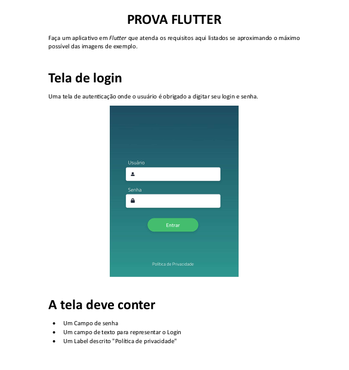
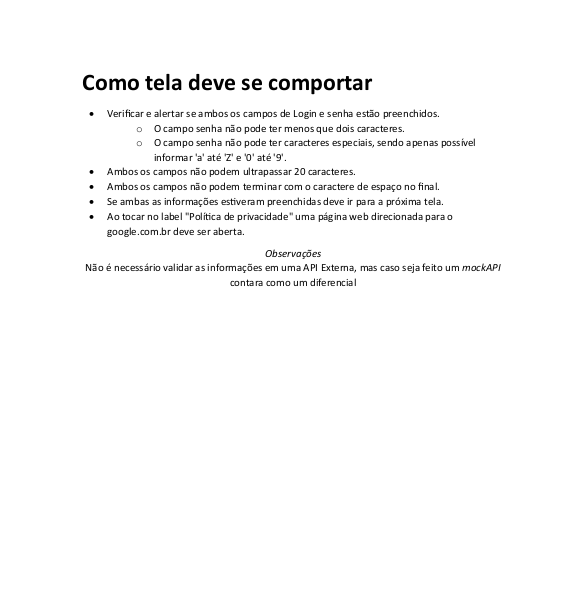
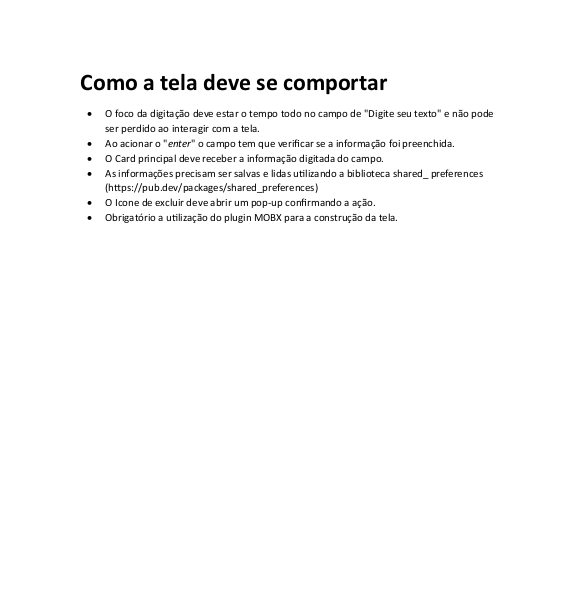

# Target_Sistemas_Prova_Flutter
I had applied for a job at **Target Sistemas Company** and then I was requested to do some *Flutter applications*. Therefore I could be evaluated about my **hard skills** and so on.






### Dependencies

- flutter: 3.5.6

### Signature and Configuration

First of all, I created my Flutter project for some application platforms, like android, ios and web, and also having my signature with this command below.
**flutter create --project-name projeto_flutter_target_sistemas --platforms android,ios,web --org br.com.estevesalxelio ./Target_Sistemas_Prova_Flutter**

### BoxDecoration - LinearGradient

I cleaned up all the default code and made a new main function. This main runs a *runApp function* and into it there is a *MaterialApp* widget.
The *MaterialApp* widget calls the *LoginPage* class.
Inside the *LoginPage* class there are a *SafeArea* and a *Scaffold* widgets.
I declared a *Container* widget in the body and inside it there is a *BoxDecoration* for *Linear Gradient*. 

### Text - TextFormField - InputDecoration - OutlineInputBorder - TextButton - ButtonStyle - RoundedRectangleBorder - BorderRadius - Icon 

I started to plan the *Login Page* placing a *Column*, and inside this a *Form* with *Text* followed by *TextFormField*. After doing that, I repeated the process once again. Under this *TextFormField* I put an *TextButton* and finally a last *Text* at the bottom page.
I made some customizations on its widgets to improve their appearance such as space between then with *SizedBox*, or using *InputDecoration* and *ButtonStyle*.

### RegExp(r'^[a-zA-Z0-9]+$') 

Implementing some functionalities for login and password. I made a validation for password field about special characters.

### User Field - Empty Values

I changed the name of *loginPressedSenha* function to *loginPressed*. I also changed the name of *alertSenhaEspecial* function to *alertSpecialPassword*.
I made a check about User field. This field is not allowed to accept an empty value.

### Password Field - Empty Values

I made a check about Password field. This field is not allowed to accep an empty value. 
This validation for empty values is one by one, and its direction is top-down, not both of them at the same time.

### Password Field - Length of Input

This validation is done for checking the length of input for password field. It is not allowed to get the length less than 2 characters and more than 20 characters at the same time.

### User Field - Length of Input

This validation is done for checking the length of input for user field. It is not allowed to get the length more than 20 characters.

### Empty Spaces - User field

I made a validation about ending with empty spaces in the User field.

### Empty Spaces - Password field

I made a validation about ending with empty spaces in the Password field.

### New Page - Mock API Validation

I added a Mock API Validation for user and password - I assigned **"Target"** for user field and **"Sistemas"** for password to navigate to the new page. 

### Launcher  - Android Manifest.xml - Google website

I improved our version for **compileSdkVersion 33** command and the path for reach this is: **android/app/build.gradle**
I needed to change some permissions on **Android Manifest**. The path for reach this is: **android/app/src/main/AndroidManifest.xml**
The command is:  **<uses-permission android:name="android.permission.QUERY_ALL_PACKAGES" />**
I should type this command above inside the Tag **<manifest xmlns:android="http://schemas.android.com/apk/res/android" ... />** at any place.
At **pubspec.yaml** I needed to place this command at 

```YAML
dependencies: 
  url_launcher: ^6.1.8
```  

### Refactoring the code

I changed all the calling *Dialog* and *Alert* functions to have only one, because I intended to avoid the repetitions. 
So I introduced a specific *String* parameter in every calling functions to solve it.

### DDD Domain-Driven Design Principles - Componentization 

I did my best to reach **Domain-Driven Design Principles**, with that said, I think it is like people and books usually say: **"Understanding is a piece of a cake but doing, it is a hard task"**.

### Tests for Validation

I used the default test packages for **Flutter in the pubspec.yaml file**

```YAML
dev_dependencies:
  flutter_test: 
    sdk:flutter
```

I had some difficulties about the **BuildContext context parameter** which I used to pass previously in this code, because in tests we do not usually use the current context in tests, but our inputs as we own wish.
So I had to be careful about **'?'** operator to assign the variable which can be optional and **'!'** operator to assign to the context that really exists like in *Navigator.push(context!)*.
After that I started to approach some application tests and I had to change the scope and the signature of function.
When I was doing theses tests, I tried to apply the **TDD and SOLID Principles** as much as I could. 

### MobX

First of all, I should put the dependencies packages in pubspec.yaml file

```YAML
dependencies: 
  mobx: ^2.2.1
  flutter_mobx: ^2.2.0
```
 
```YAML
dev_dependencies:
  mobx_codegen: ^2.4.0
  build_runner: ^2.4.7
```

By doing this our code is capable to generate and run the state of its using **Mobx**.
I should place this command on the top of file 
    *import 'package:mobx/mobx.dart';*
    and *import 'package:flutter_mobx/flutter_mobx.dart';*

I should write this command as well  
    *part'file_name.g.dart;'*  

After all of that I should run this command in the terminal: 
    **flutter packages pub run build_runner watch**

I must change this file to: 

```YAML
environment:
  sdk: ">=3.0.0 <4.0.0"
```

Because it was outdated and then I rode: 
    **flutter upgrade in the terminal to solve it**.
Set up this command: 
    **dart run build_runner watch**      placing deprecated     **flutter packages pub run build_runner watch**
I had to update 
    **flutter_lints: ^1.0.0** to a newer version like **flutter_lints: ^3.0.1**

```YAML
dev_dependencies:
  flutter_lints: ^3.0.1
```

At the *~android/gradle.properties* file I must put this to Java 9 or newer: **org.gradle.jvmargs=-Xmx1536M --add-exports=java.base/sun.nio.ch=ALL-UNNAMED --add-opens=java.base/java.lang=ALL-UNNAMED --add-opens=java.base/java.lang.reflect=ALL-UNNAMED --add-opens=java.base/java.io=ALL-UNNAMED --add-exports=jdk.unsupported/sun.misc=ALL-UNNAMED**
At the *~android/build.gradle* file I must update it from **ext.kotlin_version = '1.6.10' to ext.kotlin_version = '1.8.10'**
I had had some troubles about *kotlin and java versions*, so I have changed them to fit my project as you can see above.

### FocusNode - Focus on Text

I wrapped the whole screen with *GestureDetector* to place focus on the typing field. I instantiated a variable with *FocusNode* type and then I called it inside the *TextFormField* field.

### Add, Delete and Update Functions 

I made add, delete and update functions by this time. I changed a little bit the update functions to follow the business rules.

### Shared Preferences

```YAML
dependencies:
  shared_preferences: ^2.0.0
```

### Improve README.md with Markdown Language

I revised of my README.md file just for having more readability and a clean view of it. Making the presentation better for queries and so on.

I put this command at the beginning of this file.md only to charge all the pictures or images by Markdown Language. Its goal is showing to the people what I was requested for!

```bash


```

I made both directories as well, called assets for the first one, and images for the last one just to load the pictures or images for this application.
I put these .png files inside those directories.
And then, I updated the **pubspec.yaml** file to receive this pictures or images correctly with this code below.

```YAML
  assets:
    - assets/images/prova_flutter1.png
    - assets/images/prova_flutter2.png
    - assets/images/prova_flutter3.png
    - assets/images/prova_flutter4.png
```

### Correcting All Tests

I found some troubles when I tried to do some testing because the showDialog() Widget must have a Context, so in other words, I am obligated to pass some context when it is called!
See the implementation below to clarify what I am talking about!

```bash
class MessageDialog {

  void displayMessage(```dart 'BuildContext context' ```, String message){
    showDialog(```dart 'context: context' ```, builder: (content) => AlertDialog(
      title: const Text("Erro de validação!"),
      content: Text(message),
      actions: [
        TextButton(
          onPressed: (){
            Navigator.pop(context);
          },
          child: const Text("Entendido"),
        ),
      ],
    ),
    );
    return;
  }
}
```
As the test file or when We do some testing there isn't any **Context**, therefore I had to do a simulation for returning some Widget as a Context. 
Here it is the code snippet as an example only: 

```bash
testWidgets(
    'It should return an error message if it has empty spaces at the end of user field!',
    (WidgetTester tester) async {

      TextEditingController userController = TextEditingController(text: 'Target ');
      TextEditingController passwordController = TextEditingController(text: 'Sistemas ');
      String message = 'O campo usuário não pode terminar com espaços vazios ! Retirei os espaços vazios do final. Aperte Enter novamente por favor.';

      await tester.pumpWidget(
        MaterialApp(
          home: Builder(
            builder: (BuildContext context){
              return SizedBox();
            },
          ),
        ),
      );

      BuildContext testContext = tester.element(find.byType(SizedBox),);

      await tester.runAsync(() async {
        userFieldEndsEmpty( testContext, userController, passwordController, message);
        await tester.pump();
        await tester.pump(const Duration(seconds: 3),);
      }
      );

      expect(
          userController.text,
          equals(
              'Target '
          ),
      );
    });
```

So I had to use some functions like; 
    **tester.pumpWidget()** to wait the widget be build.
    **tester.element(find.byType(SizedBox),);** to find the widget in an specific type and then return an **object BuildContext** related to this widget.
    BuildContext usually is needed to show some dialogs as we want in this case and navigating to other pages as well.
    **tester.runAsync(() async {});** to wait all operations have been done. We usually use it with Future.delayed(Duration(seconds: 1)); for instance.

For running the tests I should type in the terminal this command below:
```bash
    flutter test test/services/validation_services_test.dart
```
